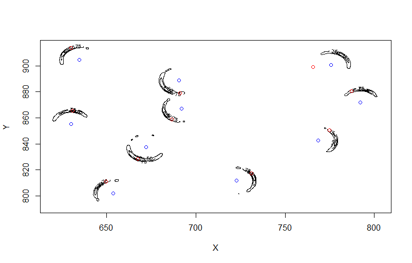

# moveStan
###Tools for movement models using STAN (mc-stan.org)

####1. Posterior checks for movement model building

Two types of posterior checks are currently available:

 + Posterior checks for angluar only predictions
   
    
  For each point along a movement track the model is used to make predictions about the angle the moving object will take. The discrepency between the predicted (density contours) and observed angle (red points) can then be compared. 
 
 
 
 + Posterior checks for position predictions (angle and distance)
   
    
  For each point along a movement track the model is used to make predictions about the subsequent position the movement object will be found. The discrepency between the predicted (density contours) and the observed positions can then be compared. 

####2. Simulate movement using stan movement models in new environments

   
  
  Often with a complex model a useful way to develop an understanding of the model is to simulate model predictions. In the context of movement  this could mean setting up a context and allowing the model to make movement predictions. The above example image was generated by simulating 4 tracks from a movement model fit to made up data. The made up data contained short movement tracks where there was a bias towards females in a group. The novel environment placed a female at one point (0,100) and a male at (100,0) and used the model to simulate predicted motions of the focal animal at (0,0). Multiple tracks (in this case 4 tracks) can be generated to gain an idea of the uncertainty in the simulated predictions. 
